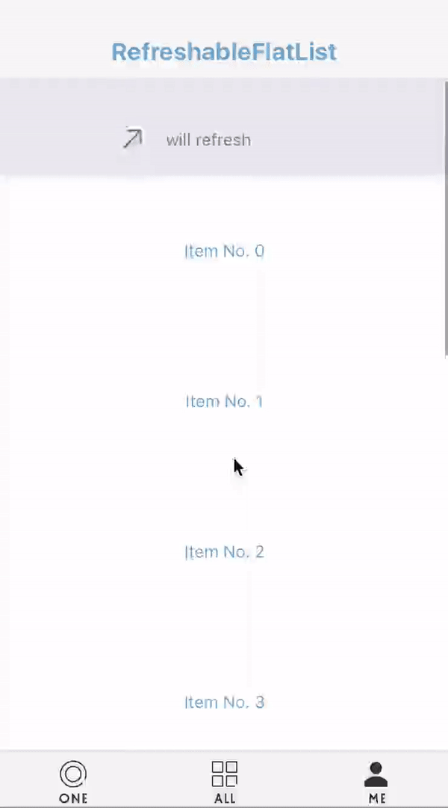
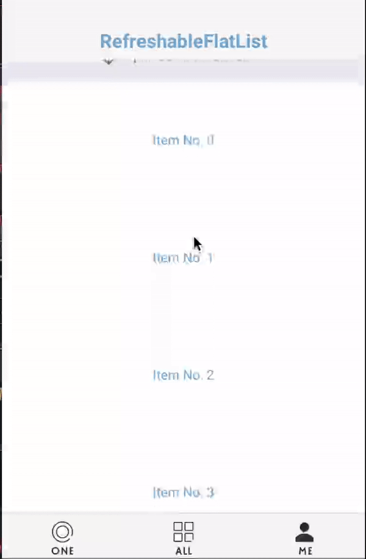

# React Native Refreshable FlatList
A pull-down-to-refresh and pull-up-to-load-more component based on [FlatList](https://facebook.github.io/react-native/docs/flatlist.html).

The component is compeletly written in js and is highly customizable.

Inspired by [react-native-refreshable-listview](https://github.com/jsdf/react-native-refreshable-listview) and [react-native-pull](https://github.com/greatbsky/react-native-pull)

##### iOS



##### Android



## Usage

 `npm install react-native-refreshable-flatlist`

### RefreshableFlatList
RefreshableFlatList  Accepts the same props as FlatList, plus a few extras (see the **props** definitions below).

```js
`import React, { PureComponent } from 'react';
import {
  View,
  Text,
  StyleSheet,
  Dimensions
} from 'react-native';
import RefreshableFlatList from 'react-native-refreshable-flatlist';

const { width } = Dimensions.get('window');
const styles = StyleSheet.create({
  container: {
    flex: 1
  },
  topBar: {
    backgroundColor: '#F7F7F8',
    height: 64,
    zIndex: 10,
  },
  row: {
    padding: 10,
    height: 125,
    width,
    backgroundColor: '#ffffff',
    borderTopWidth: 1,
    marginBottom: -1,
    borderBottomColor: '#E5EDF5',
    borderTopColor: '#E5EDF5',
    borderBottomWidth: 1,
    justifyContent: 'center'
  },
  text: {
    textAlign: 'center',
    color: '#6da3d0'
  },
  navText: {
    color: '#6da3d0',
    fontSize: 20,
    fontWeight: '700',
    textAlign: 'center',
    paddingTop: 30
  }
});

export default class Example extends PureComponent {
  state = {
    data: new Array(3).fill(1).map((x, i) => ({ id: i, text: `Item No. ${i}` })),
  }

  render() {
    return (
      <View style={styles.container}>
        <View style={styles.topBar}><Text style={styles.navText}>RefreshableFlatList</Text></View>
        <RefreshableFlatList
          data={this.state.data}
          renderItem={({ item }) => (
            <View key={item.id} style={styles.row}>
              <Text style={styles.text}>{item.text}</Text>
            </View>
          )}
          ref={(ref) => { this.flatList = ref; }}
          onRefreshing={() => new Promise((r) => {
            setTimeout(() => {
              r();
            }, 3000);
          })}
          onLoadMore={() => new Promise((r) => {
            setTimeout(() => {
              const no = this.state.data.length;
              const newArr = new Array(4).fill(1).map((x, i) => ({ id: i + no, text: `Item No. ${i + no}` }));
              this.setState({ data: this.state.data.concat(newArr) });
              r();
            }, 2500);
          })}
          keyExtractor={item => item.id}
          styles={{ prompt: { color: 'gray' } }}
        />
      </View>
    );
  }
}

```
`
#### Props

- `onRefreshing: func`
  A function returning a Promise or taking a callback, called when user pulls flatlist down to refresh.

  The top loading indicator will show until the Promise resolves or the callback is called.

- `onLoadMore: func`
  A function returning a Promise or taking a callback, called when user pulls flatlist up to load more data.

  The bottom loading indicator will show until the Promise resolves or the callback is called.

- `showTopIndicator: bool`

  Whether to show top indicator. Defaults to true.

- `showBottomIndicator: bool`

  Whether to show top indicator. Defaults to true.

- `topIndicatorComponent: oneOfType([func, element])`
  Component  shows in list header when pulling down.

- `bottomIndicatorComponent: oneOfType([func, element])`
  Component  shows in list footer when pulling up.

- `minDisplayTime: number`

  The minimum amount of time for showing the loading indicator while is refreshing. Default 300ms.

- `minPullDownDistance: number`
  Minimum distance (in px) which the list has to be scrolled off the top to 
  trigger a refresh.

- `minPullUpDistance: number`
  Minimum distance (in px) which the list has to be scrolled off the bottom to 
  trigger a data loading.


### topIndicatorComponent
`topIndicatorComponent` shows in list header when pulling and refreshing.

#### Props

- `topPullingIndicator: oneOfType([string, element])`
  Text/element shows in list header when user pulls  flatlist down. Could be image or icon.

- `topHoldingIndicator: oneOfType([string, element])`
  Text/element shows in list header when user pulls flatlist down and the pull-down distance exceeds `minPullDownDistance`. 

- `topRefreshingIndicator: oneOfType([string, element])`
  Text/element shows  in list header when refreshing.

- `topPullingPrompt: oneOfType([func, element])`

  Text/element to show alongside indicator when user pulls down.

- `topHoldingPrompt: oneOfType([string, element])`
  Text/element to show alongside indicator when user pulls flatlist down and the pull-down distance exceeds `minPullDownDistance`. 

- `topRefreshingPrompt: oneOfType([string, element])`
  Text/element to show alongside indicator when refreshing.

### bottomIndicatorComponent

`bottomIndicatorComponent` shows in list footer when pulling and data loading.

#### Props

- `bottomPullingIndicator: oneOfType([string, element])`
  Text/element shows in list footer when user pulls  flatlist up. Could be image or icon.

- `bottomHoldingIndicator: oneOfType([string, element])`
  Text/element shows in list footer when user pulls flatlist up and the pull-up distance exceeds `minPullUpDistance`. 

- `bottomRefreshingIndicator: oneOfType([string, element])`
  Text/element shows  in list header when data loading.

- `bottomPullingPrompt: oneOfType([func, element])`

  Text/element to show alongside indicator when user pulls up.

- `bottomHoldingPrompt: oneOfType([string, element])`
  Text/element to show alongside indicator when user pulls flatlist up and the pull-up distance exceeds `minPullDownDistance`. 

- `bottomRefreshingPrompt: oneOfType([string, element])`
  Text/element to show alongside indicator when data loading.

### Style the IndicatorComponent

Just past the `styles` prop to `RefreshableFlatList`, it will pass the prop to both `topIndicatorComponent` and `bottomIndicatorComponent`. The `styles` prop must has structure like below:

```Js
const styles = StyleSheet.create({
  indicatorContainer: {
    justifyContent: 'center',
    alignItems: 'center',
    flexDirection: 'row',
    height: 54,
  },
  indicator: {
    width: 24,
    height: 24,
    marginRight: 15,
    resizeMode: 'cover',
  },
  prompt: {
    color: '#6e6e6e',
    fontSize: 14
  }
});
```

